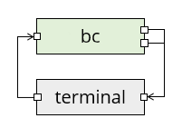
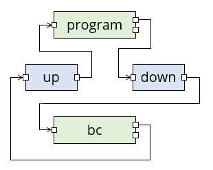

# Concurrent programming in POSIX

In your second year, you will study concurrent programming using the go programming language, which provides an abstraction called _channels_ that different _actors_ can use to talk to each other. In the case of go, the actors are threads, but the same principle applies to a concurrent system with different processes, in which case channels are a kind of _inter-process communication (IPC)_. In POSIX, pipes are a kind of channel.

  - If one process reads from a pipe, then this blocks the process until another process writes to it.
  - If one process writes to a pipe, then this blocks the process until another process reads from it.
  - If one process reads from a pipe and another process writes to it (it does not matter who goes first) then the data is transferred from the reader to the writer, and both processes continue.

For example, when you to a command like `cat logfile | grep Error | wc -l` to count the number of lines containing the word "Error", then there are three processes (not counting the terminal) and two pipes involved:


_In this diagram, green boxes are processes with standard input on the left and standard output (top) and standard error (bottom) on the right. The little squares all represent file descriptors; a pipe has two of them, one each for reading and writing._

This is not yet a fully concurrent system though, as data is only flowing in one direction: there are no loops.

As a little example of something that does have a loop, we are going to use the `bc` calculator program, which reads a line from standard input, evaluates it as a formula, and writes the result to standard output:

    alpine$ bc
    (you type) 2+3
    (bc prints) 5

`bc` reads in a loop, so type `^D` to close its standard input, then you get back to the terminal.

As a diagram, the interaction with bc looks like this:



_Here the terminal's right file descriptor is the one that the terminal reads, and the left one is where the terminal writes your keyboard input. But there's still a human in the loop here._

We are going to write a program that can talk to `bc`. This means we have two processes, our program and `bc`, and they need to communicate with each other. We will use pipes for this, giving the following diagram where we call the pipes _up_ and _down_:



_In this diagram, data flows through pipes from left to write, but logically the "down" pipe is for data flowing from our program downwards to bc, and the "up" pipe is for data flowing back up again. Standard error is not shown (it still goes to the terminal)._

The `bc` program does not need to know about any of this: it still reads expressions from its standard input, evaluates them, and writes them to standard output.

## The first program

Study the following program. It tries to add the numbers from 1 to 10 by writing the sums (1+2 etc.) to standard output, and reading the result back from standard input. You can compile it with `gcc -std=c99 -Wall ipc1.c -o ipc1` and then run it yourself: it prints `1+2` and if you reply `3`, it follows up with `3+3` and so on. After ten steps, it prints the result and exits.

```c
/* ipc1.c */
#include <stdio.h>
#include <string.h>
#include <errno.h>
#include <stdlib.h>

void check(int ok, char *where) {
  if (ok < 0) {
    fprintf(stderr, "Error in %s: %s\n", where, strerror(errno));
    exit(1);
  }
}

int evaluate(char *buffer, int len) {
  fprintf(stderr, "> %s", buffer);

  int ok = printf("%s", buffer);
  if (ok < 0) {
    return -1;
  }
  char* p = fgets(buffer, len, stdin);
  if (p == NULL) {
    return -1;
  }
  fprintf(stderr, "< %s", buffer);
  return 0;
}

int main() {
  char buffer[100];
  int ok;

  setbuf(stdout, NULL);
  setbuf(stdin, NULL);

  strcpy(buffer, "1+2\n");

  ok = evaluate(buffer, sizeof(buffer));
  check(ok, "I/O");
  
  for (int i = 3; i <= 10; i++) {
    sprintf(buffer + strlen(buffer) - 1, "+%u\n", i);
    ok = evaluate(buffer, sizeof(buffer));
    check(ok, "I/O");
  }
  fprintf(stderr, "The result is %s", buffer);
  return 0;
}
```

The program also prints a copy of all its input and output to standard error so you can see what data is being transferred. The transfer happens in `evaluate`:

  1. First, it prints the buffer to standard error (you can ignore this for now).
  2. Then, it prints the buffer to standard output with printf. Checking the return value of printf is extremely paranoid, but we're about to use the program in a situation where standard output is not the terminal, so it could potentially fail.
  3. Next, it reads a line from standard input with fgets. Checking the return value here is good practice even if you're not paranoid.
  4. Finally, it prints the received value to standard error - note that if `fgets` had returned NULL, then it would not be safe to access the buffer.

And now for the interesting part:

  - Make two named pipes (FIFOs) with `mkfifo up` and `mkfifo down`.
  - You will need two terminals open for the following. Either ssh into your alpine machine a second time or, better still, use tmux (`Control+B, %` opens a second terminal beside the first one; you can use `Control+B, Left` and `Control+B, Right` to switch between them).
  - Run the program with `./ipc1 > down < up` to redirect standard input and output to the pipes. This blocks (exercise: which statement is it currently blocking on?).
  - In the second terminal, run `bc < down > up`.

Both processes should now terminate, and although you won't see the pipes directly, standard error of your program is printing a copy to the terminal, where `>` is data sent to down pipe and `<` is data received on the up pipe:

    > 1+2
    < 3
    > 3+3
    < 6
    > 6+4
    < 10
    ...
    > 45+10
    < 55
    The result is 55

Note that the program printed the "The result is ..." line to standard error too, otherwise you would not see it here.

## Types of inter-process communication

You can use any of the following for one process to talk to another:

  - Pipes in the shell, e.g. `cat FILE | grep STRING`. We are going to learn how to manage these pipes ourselves from a C program.
  - Named pipes (FIFOs), which are pipes that have filenames.
  - `popen`, a C function that launches a new process with a pipe either for reading or writing, but not both.
  - TTYs, as explained in the lectures. The C interface for using TTYs starts with `posix_openpt()` and is fairly complicated.
  - Sockets. This includes both network sockets (TCP) and also UNIX sockets, which are another type of special file. Unlike pipes, sockets provide bidirectional communication.

We are going to be using pairs of pipes, since a single pipe only works in one direction.

## C functions

We will need the following functions for our task, all from `unistd.h`:

  - `int pipe(int fd[2])` creates a pipe. It takes an array of two integers and creates two file descriptors in them, one for the reading and one for the writing end of the pipe. Details in `man 2 pipe`, and like all system calls, you need to check the return value and look at `errno` if it is negative.
  - `int dup2(int oldfd, int newfd)` changes `newfd` to point to the same file descriptor as `oldfd`. This is the system call version of the shell redirect.
  - `pid_t fork()` creates a copy of the current process, and is the starting point for launching another process. Once you are sure that it has not returned an error, then the child process will see return value 0 and the parent process will see a return value >0, which is the process id of the child process.
  - `int execve(const char *path, char *const argv[], char *const envp[])` replaces the current process by the indicated process, this is the C version of typing a shell command except that (1) the shell does fork-then-exec and (2) there is no shell involved, so you cannot use shell features like `*` expansion or builtin commands like cd here.

Here is the basic way to launch a program from another, keeping the original program running:

```C
/* launch.c */
#include <unistd.h>
#include <stdio.h>
#include <errno.h>
#include <string.h>

char* command = "/bin/echo";
char* argv[] = {"echo", "Hello", NULL};
char* envp[] = {NULL};
/* both argv and envp must be NULL-terminated arrays,
   also argv[0] has to be the program name (busybox cares about this)
 */

int main() {
    int ok = fork();
    if (ok < 0) {
        printf("fork() failed: %s\n", strerror(errno));
        return 1;
    }
    /* ok, fork succeeded and the following code will now be running TWICE */
    if (ok == 0) {
        /* This is the child process */
        ok = execve(command, argv, envp);
        if (ok < 0) {
            printf("execve() failed: %s\n", strerror(errno));
            return 1;
        }
        /* we will never get here as if execve succeeded, we're gone */
    }
    
    /* if we got here, then we're the parent process */
    printf("Launched a child process, it has pid %u.\n", ok);
    
    return 0;
}
```
If you run this several times in a row, you might see the PID of the child increasing by 2 each time, why is this?

And here is the basic way to work with pipes:

```C

```